<!-- HERO BANNER SVG WITH EMBEDDED REAL PHOTO -->

 

  

 

<!-- RECRUITER SNAPSHOT GLASS CARD WITH REAL PHOTO & BRAND LOGOS -->
<table align="center" width="100%" style="border-collapse: collapse; border: 1px solid rgba(0, 240, 255, 0.35); border-radius: 16px; background: rgba(15, 23, 42, 0.75); backdrop-filter: blur(16px); box-shadow: 0 12px 40px rgba(0,0,0,0.5);">
  <tr>
    <td padding="24" style="padding: 24px;">
      <h3 align="left" style="margin-top: 0; color: #00F0FF; font-family: -apple-system, BlinkMacSystemFont, sans-serif; letter-spacing: 0.5px;">
        ⚡ RECRUITER SNAPSHOT &amp; QUICK OVERVIEW
      </h3>
      <table width="100%" style="border: none;">
        <tr>
          <!-- Photo Column -->
          <td width="28%" style="vertical-align: top; border: none; padding-right: 20px;">
            

              
              
Altaf Khan

              
Gurugram, India

            

          </td>
          <!-- Details Column 1 -->
          <td width="36%" style="vertical-align: top; border: none; padding-right: 15px;">
            
<strong>🟢 Status:</strong> Open for Data Analyst &amp; ML Roles

            
<strong>🎓 Current Role:</strong> Software Trainee @ <em>QSpiders Gurugram</em>

            
<strong>📍 Location:</strong> Gurugram, India (Remote &amp; On-Site)

            
<strong>💡 Tech Stack:</strong> Python, SQL, Pandas, NumPy, Power BI, ML

          </td>
          <!-- Details Column 2 -->
          <td width="36%" style="vertical-align: top; border: none; padding-left: 15px;">
            
<strong>🎯 Current Focus:</strong> Advanced SQL, Model Deployment &amp; Feature Engineering

            
<strong>🌐 Live Portfolio:</strong> <a href="https://ialtaf14.vercel.app" style="color: #00F0FF; font-weight: 700;">ialtaf14.vercel.app</a>

            
<strong>📧 Email:</strong> <a href="mailto:altafkhan122105@gmail.com" style="color: #38BDF8;">altafkhan122105@gmail.com</a>

            
<strong>💼 LinkedIn:</strong> <a href="https://www.linkedin.com/in/altaf-khan-7a544b256/" style="color: #A855F7;">linkedin.com/in/altaf-khan</a>

          </td>
        </tr>
      </table>
       
      <!-- CLICKABLE BRAND LOGO BUTTONS -->
      

        
        &nbsp;
        
        &nbsp;
        
        &nbsp;
        
        &nbsp;
        
        &nbsp;
        
      

    </td>
  </tr>
</table>

 

<!-- ABOUT ME -->
<h2 align="left" style="color: #00F0FF;">👤 ABOUT ME</h2>

I am a results-driven <strong>Data Analyst</strong> and <strong>Machine Learning Enthusiast</strong> passionate about translating raw, unstructured datasets into clear business intelligence and high-accuracy predictive models. With a Computer Science Engineering degree from Gurugram University and hands-on training in core programming, software testing, relational databases, and predictive modeling, I build end-to-end data pipelines.

My project work covers exploratory data analysis, data cleaning, feature engineering, model evaluation, and reporting. I focus on writing clean, modular code and delivering practical data-driven insights.

 

  

 

<!-- PIVOT TABLE & DATA ANALYTICS SECTION -->
<h2 align="left" style="color: #00F0FF;">📊 DATA ANALYTICS &amp; PIVOT TABLE ENGINE</h2>

  

 

<!-- TECH STACK & TOOLS -->
<h2 align="left" style="color: #00F0FF;">🛠 TECH STACK &amp; ANALYTICS TOOLKIT</h2>

<table width="100%" style="border-collapse: collapse;">
  <tr>
    <td width="33%" style="vertical-align: top; padding: 10px;">
      

        <h4 style="color: #00F0FF; margin-top: 0;">💻 Programming &amp; Querying</h4>
        
 Data Manipulation &amp; Scripting

        
 Complex Queries &amp; Aggregations

        
 Core OOP &amp; Logic

      

    </td>
    <td width="33%" style="vertical-align: top; padding: 10px;">
      

        <h4 style="color: #A855F7; margin-top: 0;">📊 Data Science &amp; ML</h4>
        
 Data Cleaning &amp; Reshaping

        
 Numerical Computations

        
 ML Predictive Algorithms

        
 Statistical Visualization

      

    </td>
    <td width="33%" style="vertical-align: top; padding: 10px;">
      

        <h4 style="color: #38BDF8; margin-top: 0;">📈 Business Tools &amp; Environment</h4>
        
 Interactive Executive Dashboards

        
 Pivot Tables &amp; VLOOKUP

        
 Version Control &amp; Repositories

        
 REST APIs &amp; Deployment

      

    </td>
  </tr>
</table>

 

<!-- SKILL PROGRESS BARS -->

  

 

  

 

<!-- MACHINE LEARNING SECTION -->
<h2 align="left" style="color: #00F0FF;">🧠 MACHINE LEARNING PIPELINE</h2>

  

 

<!-- DATA ANALYTICS DASHBOARD SECTION -->
<h2 align="left" style="color: #00F0FF;">📊 DATA ANALYTICS PERFORMANCE DASHBOARD</h2>

  

 

  

 

<!-- FEATURED PROJECTS (ORIGINAL REAL PROJECTS) -->
<h2 align="left" style="color: #00F0FF;">💻 FEATURED PROJECTS</h2>

<table width="100%" style="border-collapse: collapse;">
  <!-- Project 1: Novaflix -->
  <tr>
    <td style="padding: 20px; border: 1px solid rgba(0, 240, 255, 0.3); border-radius: 14px; background: rgba(15, 23, 42, 0.7);">
      <h3 style="color: #00F0FF; margin-top: 0;">01. Novaflix – AI-Powered Movie Recommendation Platform</h3>
      

        An AI recommendation platform featuring mood curation, real-time messaging between cinephiles, streaming availability badges, and interactive Movie DNA profiles. Uses Scikit-Learn cosine similarity for content-based metadata filtering.
      

      

        React
        &nbsp;
        Vite
        &nbsp;
        FastAPI
        &nbsp;
        Scikit-Learn
        &nbsp;
        Python
      

      
      &nbsp;
      
    </td>
  </tr>

  <tr><td style="height: 16px; border: none;"></td></tr>

  <!-- Project 2: NovaRecon -->
  <tr>
    <td style="padding: 20px; border: 1px solid rgba(112, 0, 255, 0.3); border-radius: 14px; background: rgba(15, 23, 42, 0.7);">
      <h3 style="color: #A855F7; margin-top: 0;">02. NovaRecon – OSINT &amp; Cyber Threat Intelligence Platform</h3>
      

        Next-generation threat intelligence tool built with Next.js 14, FastAPI, Tailwind CSS &amp; SQLite. Features live IP Geolocation mapping, 11-platform Social Footprint Scanner, Domain WHOIS/DNS analysis, breach exposure detection, and threat telemetry.
      

      

        Next.js 14
        &nbsp;
        TypeScript
        &nbsp;
        FastAPI
        &nbsp;
        SQLite
      

      
      &nbsp;
      
    </td>
  </tr>

  <tr><td style="height: 16px; border: none;"></td></tr>

  <!-- Project 3: RealityML -->
  <tr>
    <td style="padding: 20px; border: 1px solid rgba(56, 189, 248, 0.3); border-radius: 14px; background: rgba(15, 23, 42, 0.7);">
      <h3 style="color: #38BDF8; margin-top: 0;">03. RealityML – AI Feasibility Suite &amp; Risk Assessor</h3>
      

        An AI feasibility suite featuring an iOS-inspired glassmorphic UI, synthetic dataset generator with 100+ feature support, automated data quality analysis, sample bias checking, and data leakage detection.
      

      

        Python
        &nbsp;
        Pandas
        &nbsp;
        Scikit-Learn
        &nbsp;
        Streamlit
      

      
    </td>
  </tr>

  <tr><td style="height: 16px; border: none;"></td></tr>

  <!-- Project 4: Nova-AI -->
  <tr>
    <td style="padding: 20px; border: 1px solid rgba(245, 158, 11, 0.3); border-radius: 14px; background: rgba(15, 23, 42, 0.7);">
      <h3 style="color: #FBBF24; margin-top: 0;">04. Nova AI – Smart AI Learning Assistant</h3>
      

        Smart AI assistant powered by the Google Gemini API, designed specifically to guide students and developers through complex concepts in AI, Machine Learning, Data Science, Python, and Software Engineering.
      

      

        Python
        &nbsp;
        Gemini API
        &nbsp;
        FastAPI
        &nbsp;
        JSON
      

      
    </td>
  </tr>
</table>

 

  

 

<!-- EXPERIENCE & INTERNSHIP -->
<h2 align="left" style="color: #00F0FF;">💼 PROFESSIONAL EXPERIENCE &amp; TRAINING</h2>

<table width="100%" style="border-collapse: collapse; border: 1px solid rgba(16, 185, 129, 0.3); border-radius: 14px; background: rgba(15, 23, 42, 0.75);">
  <tr>
    <td style="padding: 24px;">
      <h3 style="color: #10B981; margin-top: 0;">🏢 Software Testing &amp; Programming Trainee</h3>
      
<strong>Organization:</strong> QSpiders Gurugram

      
<strong>Timeline:</strong> August 2025 – Present

      

        Focused on strengthening programming fundamentals, relational database query optimization (SQL), Java concepts, algorithmic problem solving, and software testing methodologies while constructing real-world software &amp; data development projects.
      

      

        <a href="https://qspiders.com/branches/gurugram-jspiders?branchId=58-branchId" style="color: #00F0FF; text-decoration: underline; font-weight: 600;">
          🔗 Official Branch Verification (QSpiders Gurugram)
        </a>
      

    </td>
  </tr>
</table>

 

<!-- CAREER TIMELINE -->
<h2 align="left" style="color: #00F0FF;">MAP LEARNING JOURNEY &amp; ROADMAP</h2>

  

 

  

 

<!-- LIVE GITHUB ANALYTICS & WIDGETS -->
<h2 align="left" style="color: #00F0FF;">📈 GITHUB ANALYTICS &amp; DASHBOARD</h2>

  
  &nbsp;
  

  
  &nbsp;
  

 

<h3 align="left" style="color: #A855F7;">🔥 CONTRIBUTION GRAPH</h3>

  

 

<h3 align="left" style="color: #38BDF8;">🏆 GITHUB ACHIEVEMENTS &amp; TROPHIES</h3>

  

 

  

 

<!-- CONNECT SECTION WITH CLICKABLE BRAND LOGOS -->
<h2 align="left" style="color: #00F0FF;">🌐 CONNECT &amp; COLLABORATE</h2>

Click any official brand logo below to connect directly across channels:

  
  &nbsp;
  
  &nbsp;
  
  &nbsp;
  
  &nbsp;
  
  &nbsp;
  

  

<!-- FOOTER -->

  
  
   
  
  

    <strong>Designed with Apple x OpenAI x Linear aesthetic</strong> • Crafted with ❤️ by <strong>Altaf Khan</strong>
  

  

    <a href="#top" style="color: #00F0FF; font-weight: 700; text-decoration: none;">⬆ Back To Top</a>
  

